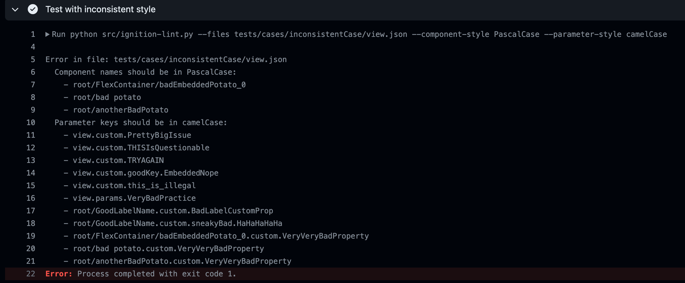

# Ignition `view.json` Linter

This GitHub Action performs linting on Ignition `view.json` files to ensure proper naming conventions are followed for component names and parameter keys.

## Inputs

### `files` (optional)

Comma-separated list of paths or glob patterns to the Ignition `view.json` files to be linted. Glob patterns are supported, e.g., `**/view.json` to match all `view.json` files recursively.

The default value is `**/view.json` to capture all Perspective views.

### `component_style` (optional)

Naming convention style for components. Cannot be used with `component_style_rgx`.

Options:

* `PascalCase`
* `camelCase`
* `snake_case`
* `UPPER_CASE`
* `Title Case`

### `parameter_style` (optional)

Naming convention style for parameters. Cannot be used with `parameter_style_rgx`.

Options:

* `PascalCase`
* `camelCase`
* `snake_case`
* `UPPER_CASE`

### `component_style_rgx` (optional)

Regex pattern for naming convention style of components. Cannot be used with `component_style`.

### `parameter_style_rgx` (optional)

Regex pattern for naming convention style of parameters. Cannot be used with `parameter_style`.

> [!IMPORTANT]
> While the following inputs are optional, at least one input of each type is required to define the style for that type. Define naming styles for components and parameters using either predefined (*_style) or regex (*_style_rgx) conventions. For example, to define the style for components, you must use the input variable `component_style` or `component_style_rgx`, but not both.

## Outputs

None

## Usage

To use this Action in your workflow, create a workflow file (e.g., `.github/workflows/lint-ignition-views.yml`) in your repository and add one of the following configurations:

* Standard supported style definition

  ```yaml
  jobs:
    lint:
      runs-on: ubuntu-latest
      steps:
        - uses: actions/checkout@v4
        - name: Lint files
          uses: ia-eknorr/ignition-lint@v2.0
          with:
            files: "path/to/your/view.json"
            component_style: "PascalCase"
            parameter_style: "camelCase"
  ```

* Regex style definition (kebab-case example)

  ```yaml
  jobs:
    lint:
      runs-on: ubuntu-latest
      steps:
        - uses: actions/checkout@v4
        - name: Lint files
          uses: ia-eknorr/ignition-lint@v2.0
          with:
            files: "path/to/your/view.json"
            component_style: "^[a-z]+(-[a-z]+)*$"
            parameter_style: "^[a-z]+(-[a-z]+)*$"
  ```

### Action scenarios

* No style conflicts
  * The check will pass
* No files given
  * The test will pass
* Style conflicts are found
  * The action will fail with logs showing the bad names
  
